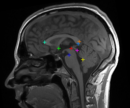
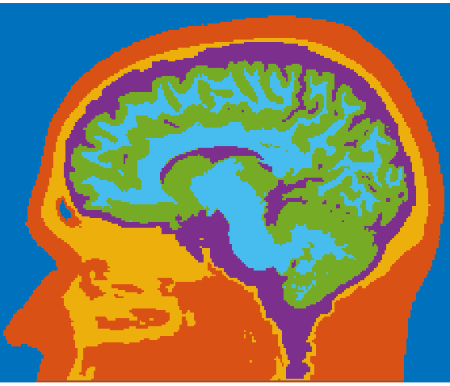
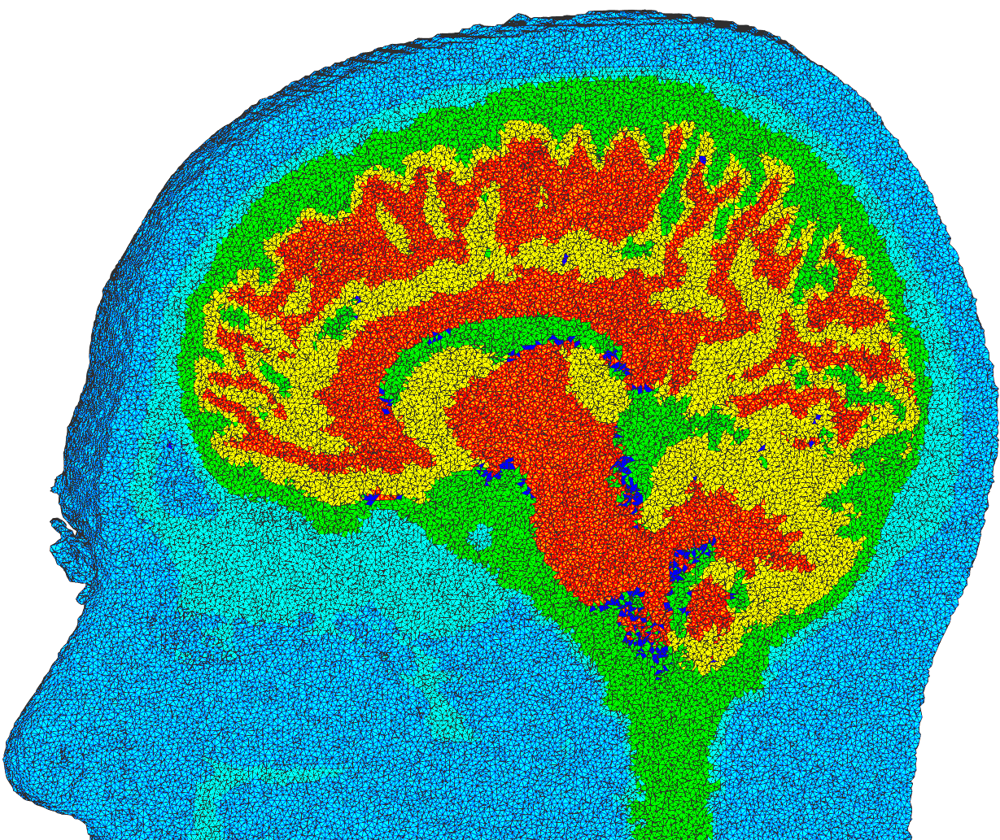
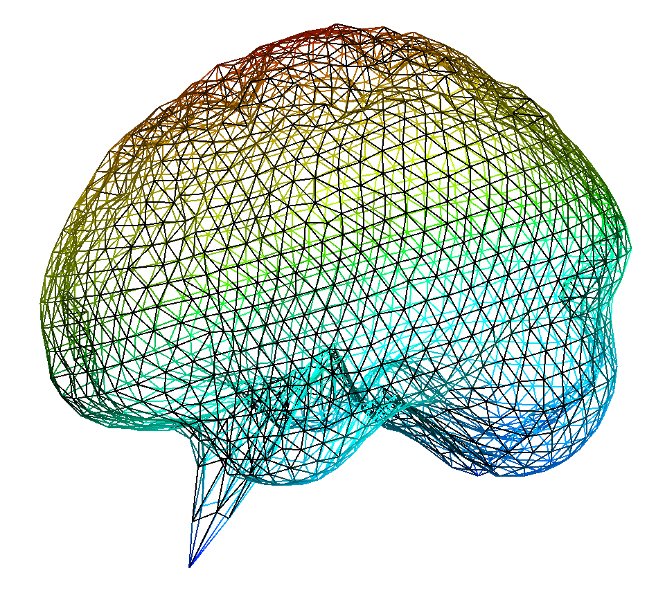
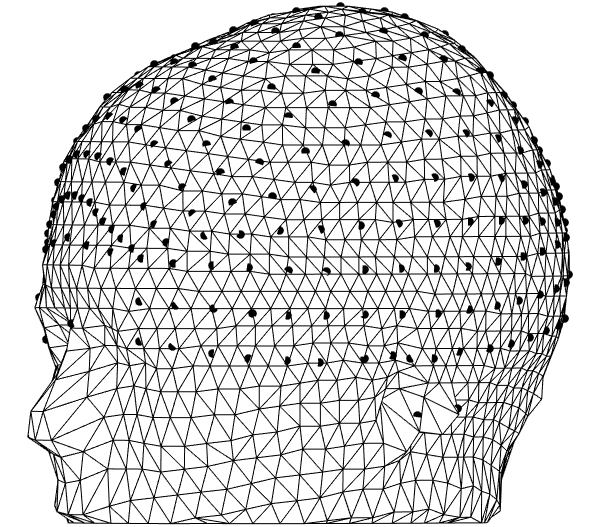
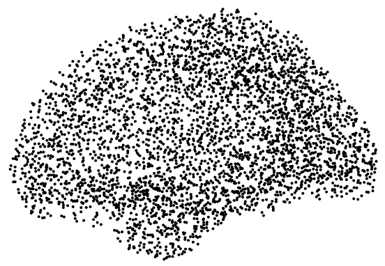

# MRIsegmentation
### Automatic MRI segmentation pipeline for consistent [FEM](https://en.wikipedia.org/wiki/Finite_element_method) and [BEM](https://en.wikipedia.org/wiki/Boundary_element_method) mesh creation from MRI scans of human heads
**0. <ins>[Install prerequisites](#Prerequisites)</ins>**<br>
**1. <ins>[Translation to ACPC-coordinate system](#translation-to-acpc)<ins>**<br>
**2. <ins>[Tissue segmentation (Scalp, Skull, CSF, White Matter, Gray Matter)](#tissue-segmentation)</ins>**<br>
**3. <ins>[Surface and Volume Mesh construction](#mesh-construction)</ins>**<br>
**4. <ins>[Correction and smoothing of segmentation mistakes](#correction-and-smoothing)</ins>**<br>
**5. <ins>[Alignement of electrodes (and sourcemodels)](#electrode-and-sourcemodel-alignement)</ins>**<br>
**6. <ins>[Parallelized Computing](#run-full-pipeline)</ins>**<br>
**A. <ins>[References](#references)</ins>**<br>
<br>
<br>


## Prerequisites
### This segmentation pipeline connects these awesome open source projects:
* [Automatic Temporal Registration Algorithm (ATRA)](https://www.nitrc.org/projects/art) [[1]](#ref1)
* [Statistical Parametric Mapping (SPM12)](https://www.fil.ion.ucl.ac.uk/spm/software/spm12/) <br>
* [Andy's tools](https://www.parralab.org/segment/) [[3]](#ref3)
* [iso2mesh](http://iso2mesh.sourceforge.net)	[[4]](#ref4)
* [Computational Anatomy Toolbox (CAT12)](http://www.neuro.uni-jena.de/cat/)	[[5]](#ref5)
* [fieldtrip](http://www.fieldtriptoolbox.org/) [[6]](#ref6)
* [Open Access Series of Imaging Studies (OASIS)](http://oasis-brains.org/) [[7]](#ref7) <br>
<br>

<!--- 
[extended Tissue Probability Map (eTPM.nii)](http://neuralengr.com/segment/) [[3]](#ref3)
freesurfer (conversion to nifti)
--->

### How to get up and running:
- Install Matlab and its [NIfTI and ANALYZE tools](https://www.mathworks.com/matlabcentral/fileexchange/8797-tools-for-nifti-and-analyze-image).
<!--- 
- Install [fieldtrip](http://www.fieldtriptoolbox.org/download/). [SPM12](https://www.fil.ion.ucl.ac.uk/spm/software/spm12/) should come with it; if not, install it, too.
- Download ATRA for [Linux](https://www.nitrc.org/frs/download.php/10393/atra1.0_LinuxCentOS6.7.tar.gz) / [Mac](https://www.nitrc.org/frs/download.php/10394/atra1.0_macOS.10.12.6.tar.gz) into `/usr/local/art/`.
--->
- Run the following commands in a terminal:<br>

<!--- 
- Install [CAT12](http://www.neuro.uni-jena.de/cat/index.html#DOWNLOAD), unzip and move the cat12 folder into `fieldtrip/external/spm12/toolbox`.
https://neuroimage.usc.edu/brainstorm/Tutorials/SegCAT12
--->
```bash
# Clone repository
$ git clone https://github.com/harmening/MRIsegmentation.git
$ cd MRIsegmentation
# Install fieldtrip
$ git clone https://github.com/fieldtrip/fieldtrip.git
# Install SPM12 
$ wget -P ./ https://www.fil.ion.ucl.ac.uk/spm/download/restricted/eldorado/spm12.zip
$ rm -r ./fieldtrip/external/spm12
$ unzip spm12.zip -d ./fieldtrip/external/
$ cd ./fieldtrip/external/spm12/src
$ make distclean
$ make && make install
$ make external-distclean
$ make external && make external-install
$ cd ../../../../ && rm spm12.zip
# Install CAT12
$ wget -P ./ http://www.neuro.uni-jena.de/cat12/cat12_r1743.zip
$ rm -r ./fieldtrip/external/spm12/toolbox/cat12
$ unzip cat12_r1743.zip -d ./fieldtrip/external/spm12/toolbox/
$ rm cat12_r1743.zip
# Install iso2mesh
$ git clone https://github.com/fangq/iso2mesh.git
# Download Andy's tools
$ wget -P ./ https://www.parralab.org/segment/Huang_et_al_2013.zip
$ unzip Huang_et_al_2013.zip -d ./Huang_et_al_2013
$ rm Huang_et_al_2013.zip
# Minor changes to make new_segment storing the nonlinear warp
$ sed -i.bak 's/warp\.write = \[0 0\]/warp\.write = \[1 1\]/' Huang_et_al_2013/start_seg.m  && rm Huang_et_al_2013/start_seg.m.bak
```
- The coordinate systems are defined by the MRI scanner's coordinate systems. For optional [translation into the ACPC-coordinate system](#translation-to-acpc) before segmentation, download [atra for linux](https://www.nitrc.org/frs/download.php/10393/atra1.0_LinuxCentOS6.7.tar.gz/?i_agree=1&release_id=3672) (register at nitrc.org, agree to the license terms), move the downloaded `atra1.0_LinuxCentOS6.7.tar.gz` into `./art` and run the following commands in a terminal:<br>
```bash
# Install atra
$ export ARTHOME="$(pwd)/art"; export PATH=$ARTHOME/bin:$PATH
$ cd $ARTHOME
$ gunzip atra1.0_*.tar.gz
$ tar -xvf atra1.0_*.tar
$ rm atra1.0_*.tar; rm atra1.0_*.tar.gz;
```


### How to start segmentation:
The MRI scan needs to be in NIfTI file format (.nii or .nii.gz).
```bash
# Change parameters in start_segmentation.m and run 
$ matlab -r "start_segmentation(./example_head/T1.nii); exit;"
```
<!--- 
# Or alternatively in parallel:
$ python parallel.py ./data/MRI_scan1/T1.nii ./data/MRI_scan2/T1.img ./data/MRI_scan3/T1.nii.gz
--->
<br>
<br>
<br>


## Translation to ACPC
 - Anatomical landmark detection, especially anterior and posterior 
    <br>
 commissures (AC/PC).
 - Reorientation from MRI scanner coordinates into the comparable ACPC <br>
   coordinate system (origin at AC, RAS orientation (x = right, y = anterior, <br>
   z = superior), original size i.e. not normalized to a template)
 - For more details refer to [[1]](#ref1).<br>
<br>

## Tissue segmentation
- The posterior probability of each MRI voxel belonging to a specific tissue type
 <br>
  (scalp, skull, cerebrospinal fluid (CSF), gray matter (GM), white matter(WM)) <br>
  is estimated by the "Unified Segmentation" framework of [[2]](#ref2) as implemented <br>
  as *new_segment* in SPM12.
- As prior probability distribution template the extended tissue probability map (Huang_et_al_2013/eTPM.nii) developed in [[3]](#ref3) is used.
- The calculated probability distributions are stored (c1, c2, ..) and converted <br>
  into binary masks for each tissue (mask_scalp.nii, mask_skull.nii, ..), followed <br>
  by smoothing using a Gaussian low-pass filter using *Andys tools* [[3]](#ref3).
- The following automatic correction of obvious morphological errors includes assigning unassigned voxels and reclassifying GM voxels, that are directly adjacent to skull voxels, as CSF voxels in order to avoid potential CSF discontinuities. The final segmented MRI is stored as segmentedmri.mat.<br>
<br>

## Mesh construction
- Boundary surface meshes per tissue are triangulated with *cgalsurf* as 
 <br>
  implemented in the fieldtrip toolbox [[6]](#ref6). From these meshes (bnd5.mat) <br>
  and (bnd4.mat, merged GM and WM to one cortex mesh) corresponding <br>
  5-shell and 4-shell Boundary Element Method (BEM) models can be built.
- A volumetric tetrahedral mesh is constructed using vol2mesh [[4]](#ref4). <br>
  Using *cgalmesh* it creates high-quality Delaunay tetraeder (see <br>
  plotted tissued voxels to the right), that can be used for Finite <br>
  Element Method (FEM) modelling. Nodes, faces, elements and voxel <br>
  labels are stored as mesh5.mat.<br>
<br>

## Correction and smoothing 
- Tests on the [OASIS1 database](http://oasis-brains.org/) of 416 human heads [[7]](#ref7) revealed, that 
 <br>
  10 out of 416 segmentations needed further correction of the cortical <br>
  surface mesh only (see segmentation error and correction to the right).
- The correction is done by recalculating abnormal vertex positions <br>
  (as in example to the right) relative to their neighboring mesh nodes.
- For an extra smooth cortex (GM+WM) surface a further Laplace flow <br>
  mesh smoothing is applied.<br>
<br>

## Electrode alignement
- Nonlinear alignment of [standard electrode positions](http://www.fieldtriptoolbox.org/template/electrode/) by using SPMs nonlinear,
 <br>
voxel-wise transformation mapping from the eTPM (in MNI space) to the individual head coordinates.
- Refinement of electrode positions by projecting them directly onto the segmented scalp mesh. This small projection corrects for minimal mesh approximation errors and ensures that all electrodes are perfectly placed on the outermost mesh and thus can be used directly for BEM modelling.
- Accurate nonlinear warping of [fiducials (nasion (NAS), left and right pre-auricular (LPA/RPA))](http://www.fieldtriptoolbox.org/template/) gained from manual expert selection on a high resolution segmentation.<br>
<br>

## Sourcemodel creation
- EEG source model estimation by using CATs [[5]](#ref5) accurate cortex segmentation and
 <br>
 cortical thickness determination.
- A source model surface mesh is created at 2/3 distance between the gray and white matter surface using the cortical thickness estimation.
- The mesh vertices constitute the source model positions. The equivalent current dipoles are orientated according to their outwards pointing mesh normals.
<br>

## Transformation to fiducial based coordinate systems
 - Transformation of meshes, electrode positions and sourcemodels to coordinate systems, that are based on individual fiducical positions (e.g. CTF).
 - The individual fiducials (NAS, LPA, RPA) are gained through SPMs nonlinear mapping from the eTPM template.<br>
<br>
<br>


## Troubleshooting
- SPM12 sometimes failes due to fieldtrip routines replacing standard matlab
  routines. Make sure to delete (or remove from matlab search path) older matlab version folders from `./fieldtrip/compat/` and `./fieldtrip/external/spm12/external/fieldtrip/compat/`. For more information visit [https://github.com/fieldtrip/fieldtrip/blob/master/compat](https://github.com/fieldtrip/fieldtrip/blob/master/compat/matlablt2010b/README).

<br>
<br>

<!---
## Run full pipeline
The whole robust segmentation pipeline can be run via `main.m` or parallelized via the python wrapper `parallel.py`.<br>
<br>
<br>


## To Dos
- Make unit choosable
- Rewrite fieldtrip functions to kick out fieldtrip dependency
<br>
<br>
--->


<!---
## All matlab scripts + preprocessing can be run via main.m or parallelized via parallel.py
### It consists of
 - full segmentation pipeline call
 - surface boundary file conversion from matlab to tri (openmeeg/python)
(See also parallel_segmentation.py from Repo https://gitlab.tubit.tu-berlin.de/promillenille/OASIS)
**All matlab scripts can be run via the Huang_et_al_2013/run_segmentation_pipe.sh script. It consecutively calls**
### Huang_et_al_2013/start_seg.m
 - Gateway script to start running the SPM8 new segment.
 - Needed: SPM8 batch editor (https://www.fil.ion.ucl.ac.uk/spm/software/spm8/)
 - Input: T1, (T2), eTPM.nii
 - Output: Segmented tissue classes c1, c2, ... c6 into basefolder

### Huang_et_al_2013/mysegment.m
 - Automated Segmentation Clean Up + Tissue Smoothing (Andy Tools)
 - Needed: NIfTI Toolbox (http://www.mathworks.com/matlabcentral/fileexchange/8797)
 - Input: basefolder with c1-c6 files from SPM8
 - Output: Tissue masks mask_gray.nii, ... mask_skin.nii into basefolder

### MRIsegmentation/create_surface_meshes.m
 - Automatic triangle surface mesh generation. Tissues: scalp, skull, csf, cortex. Resolution each: 1922
 - Needed: FieldTrip Toolbox (http://www.fieldtriptoolbox.org/)
 - Input: basefolder with tissue masks from Andy tools
 - Output final segmentedmri.mat, surface meshes bnd4_1922.mat (in mm), bnd4_1922_corrected.mat (in m)

### MRIsegmentation/create_volume_meshes.m
 - Automatic volumetric tetrahedral mesh generation. Tissues: scalp, skull, csf, cortex. Voxel resolution: 1mm.
 - Needed: FieldTrip Toolbox (http://www.fieldtriptoolbox.org/)
 - Input: basefolder with tissue masks from Andy tools
 - Output final segmentedmri.mat, surface meshes bnd4_1922.mat (in mm), bnd4_1922_corrected.mat (in m)

### Huang_et_al_2013/electrode_placement.m (optional)
 - Electrode Placement of electrode coordinates D_74.mat and D_93.mat obtained from EasyCap (http://www.easycap.de/easycap/e/downloads/M1_ThetaPhi.htm)
 - Needed: NIfTI Toolbox (http://www.mathworks.com/matlabcentral/fileexchange/8797)<br />
           Natural Cubic Spline (http://www.mathworks.co.jp/matlabcentral/fileexchange/7617)
 - Input: D_74, D_93 or individual electrode coordinates, scalp_mask, nasion,inion,right,left,front_neck (required landmarks provided by the user through MRIcro 3D viewer)
 - Output: mask_elec.nii and mask_gel.nii 
 - CAUTION: not tested !
--->


<!---
### Not used: 
 - nipype
 - afni (https://afni.nimh.nih.gov/pub/dist/doc/htmldoc/background_install/install_instructs/steps_mac.html)
 - some more small scripts
--->


## References
<a id="ref1">[1]</a> Babak A. Ardekani and Alvin H. Bachman. "Model-based automatic detection of the anterior and posterior commissures on MRI scans" *NeuroImage*, (2009): **46**(3), 677 - 682. [``doi:10.1016/j.neuroimage.2009.02.030``](https://doi.org/10.1016/j.neuroimage.2009.02.030). <br> 
<!---  \cite{Ardekani09}  --->
<a id="ref2">[2]</a>  John Ashburner, Karl J. Friston. "Unified segmentation" *NeuroImage*, (2005): **26**(3), 839 - 851. [``doi:10.1016/j.neuroimage.2005.02.018``](https://doi.org/10.1016/j.neuroimage.2005.02.018). <br> 
<!--- \cite{Ashburner05} --->
<a id="ref3">[3]</a>  Yu Huang, Jacek Dmochowski, Yuzhuo Su, Abhishek Datta, Chris Rorden, Lucas Parra. "Automated MRI Segmentation for Individualized Modeling of Current Flow in the Human Head" *Journal of Neural Engineering*, (2013): **10**, 066004. [``doi:10.1088/1741-2560/10/6/066004``](https://doi.org/10.1088/1741-2560/10/6/066004). <br> 
<!--- \cite{Huang2013}  --->
<a id="ref4">[4]</a>  Qianqian Fang, David A. Boas. "Tetrahedral Mesh Generation from Volumetric Binary and Gray-Scale Images" *Proceedings of IEEE International Symposium on Biomedical Imaging*, (2009), 1142-1145. [``doi:10.1109/ISBI.2009.5193259``](https://doi.org/10.1109/ISBI.2009.5193259).<br> 
<!---  \cite{Fang2009*} --->
<a id="ref5">[5]</a> Christian Gaser, Robert Dahnke. "CAT - A Computational Anatomy Toolbox for the Analysis of Structural MRI Data" (2016): [http://www.neuro.uni-jena.de/hbm2016/GaserHBM2016.pdf](http://www.neuro.uni-jena.de/hbm2016/GaserHBM2016.pdf).<br>
<!---  \cite{Gaser2016} --->
<a id="ref6">[6]</a>  Robert Oostenveld, Pascal Fries, Eric Maris, Jan-Mathijs Schoffelen. "FieldTrip: Open Source Software for Advanced Analysis of MEG, EEG, and Invasive Electrophysiological Data" *Computational intelligence and neuroscience*, (2011), 156869. [``doi:10.1155/2011/156869``](https://doi.org/10.1155/2011/156869). <br> 
<!---  \cite{Fieldtrip11}  --->
<a id="ref7">[7]</a>  Daniel S. Marcus, Tracy H. Wang, Jamie Parker, John G. Csernansky, John C. Morris, Randy L. Buckner. "Open Access Series of Imaging Studies (OASIS): Cross-sectional MRI Data in Young, Middle Aged, Nondemented, and Demented Older Adults" *Journal of Cognitive Neuroscience*, (2007): **19**(9), 1498-1507. [``doi:10.1162/jocn.2007.19.9.1498``](https://doi.org/10.1162/jocn.2007.19.9.1498). <br> 
<!--- \cite{OASIS2007}  --->
